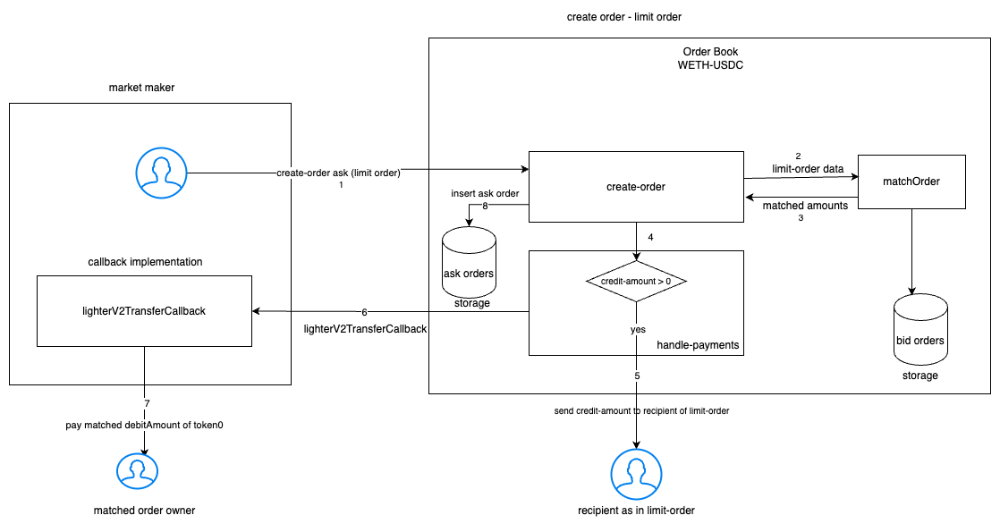
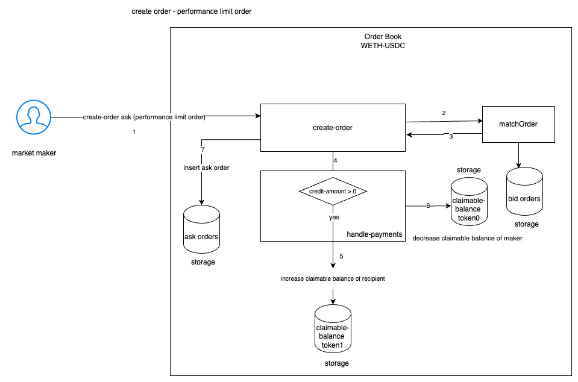
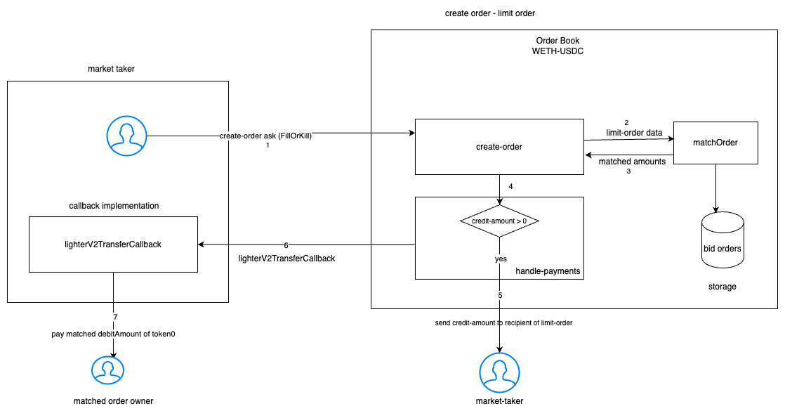
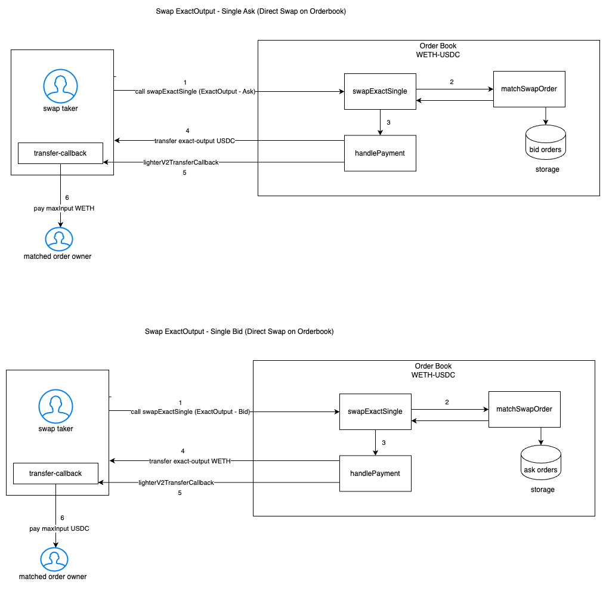

# Lighter Exchange V2

[](https://badge.fury.io/js/@elliottech%2Flighter-v2-core)

Lighter is fully decentralized order book exchange protocol designed for permission-less, zero slippage and MEV-protected trades.

Core contracts make up the Lighter Exchange's foundation. They are composed of the Factory and an Order Book for each supported
token pair. At the moment, only the Lighter governance which is run by Lighter team is able to deploy new token pairs. 


## Factory
The Factory contract handles creating Order Books. Users can tap into the Factory contract to find out about different order books or to grab the order book for a specific token pair.

## Order Book
Each supported pair gets its own Order Book contract.
This contract stores the data and ERC-20 tokens for open orders, and implements the matching engine that is used when matching crossing orders.
Users can interact directly with Order Book contracts, but the interaction should go through a smart contract that implements the payment interface.
Also, interacting directly with the order book allows users do zero fee flash-loans.

The order book support 4 order types:
- Limit Order
- Performance Limit Order
- FillOrKill Order
- ImmediateOrCancel Order

Note: The Performance Limit Order reduces gas cost and is only available if the caller is a smart contract which is integrated directly with the Lighter smart contracts.   

## Interacting with the Order Book

### View Functions to query for Orders in Orderbook
- `getPaginatedOrders`
- `suggestHintId` - to get the hintId to be used for `creatOrder` 
- `isOrderActive`
- `isAskOrder`

### Limit Order

1. Limit Order created by maker via call on `createOrder` function of `OrderBook`
2. all essential validations are executed and `matchOrder` is called to match the limitOrder with orderBook
3. If the order gets matched with orders in orderbook, then credit the recipient in `limitOrder` with creditTokens (token1/token0)
4. call the callback implementation of `marketMaker` to transfer the matched-amount owed to the matched-order-owner
5. insert the order to orderBook with the remaining unfilled/unmatched amount (token0/token1)



### Performance Limit Order

1. Performance limit order is an optimized limit order type built for gas efficient market making.
2. The key differentiator between performance limit orders and regular limit orders is that instead of asking market makers to send tokens to the order book, performance limit orders utilizes the already deposited tokens for payments.
3. Market makers can deposit base or quote tokens to the order book via depositToken to be used for their performance limit orders.
4. Market makers can withdraw their deposited tokens via claimToken at any time.
5. Instead of using transferCallback and transfer functions for payments, performance limit orders utilizes internal balance mappings.
6. Avoiding external calls and multiple storage updates allows significant gas savings for market makers.

_reduces the gas cost for market-making by ~14500 for the first order created and by ~7250 for subsequent orders in the same transaction_




### FOK (FillOrKill Order)

1. FillOrKill Order created by taker via call on `createOrder` function of `OrderBook`
2. all essential validations are executed and `matchOrder` is called to match the limitOrder with orderBook
3. If the order gets matched with orders in orderbook, then credit the recipient in `limitOrder` with creditTokens (token1/token0)
4. call the callback implementation of `marketMaker` to transfer the matched-amount owed to the matched-order-owner
5. If order is not completely filled, transaction is to be reverted



### DirectSwap on Order Book
SwapExactSingle in orderbook supports 2 types of swaps:
- SwapExactInput
- SwapExactOutput

#### SwapExactInput-Single on Order Book

1. Swap an exactAmount of token0/token1 in return for minimumOutput of token1/token0
2. User calling this function on orderbook is expected to implement a callback function to handle payments
3. Match-Phase of swapExactInput will return the filledAmounts of token0 and token1
    - here filledAmounts are the amount of tokens that swap-taker owes to matched-order-owner
    - amount of tokens that swap-taker must receive as exactInput


#### SwapExactOutput-Single on Order Book

1. Swap-Taker to pay maximumInput of token0/token1 and receive exactAmount of token1/token0
2. User calling this function on orderbook is expected to implement a callback function to handle payments
3. Match-Phase of swapExactOutput will return the filledAmounts of token0 and token1 
   - here filledAmounts are the amount of tokens that swap-taker owes to matched-order-owner
   - amount of tokens that swap-taker must receive as exactInput



## Contract Structure

```bash
contracts
├── Factory.sol
├── OrderBook.sol
├── interfaces
│   ├── IFactory.sol
│   ├── ILighterV2FlashCallback.sol
│   ├── ILighterV2TransferCallback.sol
│   ├── IOrderBook.sol
│   └── external
│       └── IERC20Minimal.sol
└── libraries
    ├── Errors.sol
    ├── LinkedList.sol
    └── OrderBookDeployerLib.sol
```

## Extend this locally

```
npm install
npm compile
npm test
```

## License

- The primary license for Lighter V2 is the Business Source License 1.1 (`BUSL-1.1`)
- All external interface files in `contracts/interfaces/` are licensed under `SPDX-License-Identifier: MIT`
